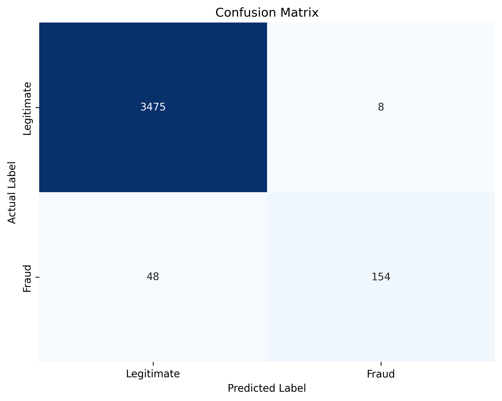
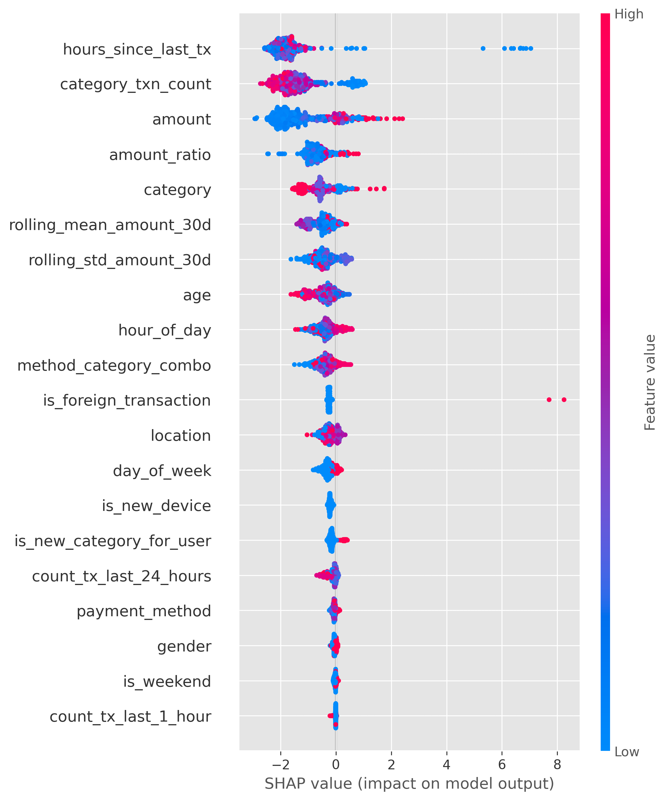
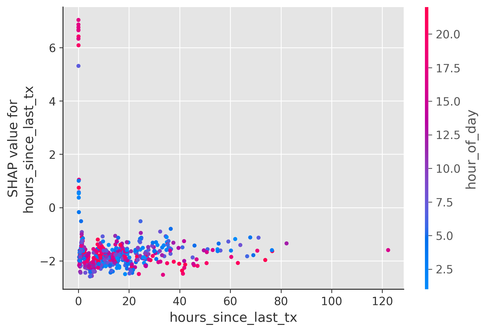

# 🛡️ Fraud Detection System Using Synthetic Transaction Data

## 📋 1. Project Overview

This project implements an end-to-end machine learning system for detecting fraudulent financial transactions. Given the sensitivity and scarcity of real-world fraud data, the system utilizes a robust synthetic data generation engine to create realistic transaction patterns.

**Goal:** Build a transparent, explainable, and high-performance fraud detection pipeline that can identify specific fraud patterns such as account takeovers, merchant abuse, and velocity attacks.

**✨ Key Features:**

- 🧪 **Synthetic Data Generation**: Realistic simulation of user behavior and fraud injection.
- 🕒 **Time-Aware Modeling**: Strict adherence to temporal ordering to prevent data leakage.
- 🤖 **XGBoost Classifier**: Specific handling of class imbalance and non-linear patterns.
- 🔍 **SHAP Explainability**: Global and local interpretation of model decisions.
- 🕸️ **Graph Intelligence (Bonus)**: Neo4j integration to detect fraud rings and shared device abuse.

---

## 🚀 2. Approach Overview

The system follows a modular pipeline design:

1. **Data Generation**: (`src/generate_data.py`) Creates users, merchants, and transactions with injected fraud.
2. **Feature Engineering**: (`src/feature_engineering.py`) Transforms raw logs into predictive features using rolling windows.
3. **Model Training**: (`src/train_model.py`) Trains an XGBoost model with time-based splitting and cost-sensitive learning.
4. **Explainability**: (`src/explain_model.py`) Generates SHAP plots to explain predictions.
5. **Validation**: (`src/test_on_real_data.py`) Evaluates performance on external datasets (PaySim/BankSim).
6. **Graph Analysis**: (`src/graph_ingestion.py`) Performs post-hoc graph analysis using Neo4j.

---

## 🧪 3. Synthetic Data Generation (Part 1)

To mimic a real-world payment platform, we generated a dataset of **18,423 transactions**.

### 👥 Entities

- 👤 **Users**: 1,000 distinct users with demographic attributes (Age, Gender) and spending habits.
- 🏪 **Merchants**: 50 merchants across 15 categories (e.g., `es_tech`, `es_transportation`).
- 💳 **Transactions**: Time-ordered sequence of payments over a 30-day period.

### 📊 Dataset Characteristics

- **Size**: ~18.4k rows.
- **Fraud Rate**: ~3.47% (Imbalanced).
- **Ordering**: Strictly chronological.

**🧐 Assumptions**:

- Users behave consistently (e.g., they don't suddenly change their "home" country without a reason).
- Fraud is not random noise; it follows specific, identifiable strategies.

---

## 🕵️‍♂️ 4. Fraud Pattern Design (Part 2)

The core of this project is the realistic injection of 8 distinct fraud patterns. This ensures the model learns actual behaviors rather than just fitting to random noise.

| Pattern                             | Description                                           | Why it's Realistic                                  |
| :---------------------------------- | :---------------------------------------------------- | :-------------------------------------------------- |
| **1. High Velocity**          | >4 transactions in 1 hour.                            | Standard aggressive carding/cashing out behavior.   |
| **2. Amount Spikes**          | Transaction > 300% of user's avg.                     | Fraudsters aim to maximize profit before detection. |
| **3. Location Inconsistency** | User suddenly transacts in a foreign country.         | Indicates stolen credentials or card cloning.       |
| **4. Merchant Abuse**         | Same merchant, multiple times, short window.          | Testing a specific vulnerable merchant.             |
| **5. Shared Device**          | Device ID used by >3 distinct users.                  | Sign of a device farm or botnet.                    |
| **6. Dormant Account**        | Activity after 60+ days of silence.                   | Account takeover (ATO) of old lists.                |
| **7. Escalation**             | Small amounts ($1, $5) followed by huge charge.       | "Card testing" before the main theft.               |
| **8. Payment Switching**      | Sudden change in payment method (e.g., Card -> Wire). | Bypass limits or security checks.                   |

---

## ⚙️ 5. Feature Engineering (Part 3)

Raw columns (`amount`, `timestamp`) are insufficient for detection. We engineered 30+ features focusing on time and behavior.

### 🔑 Key Features

1. **Velocity**: `count_tx_last_1_hour`, `txns_last_10min` (Rolling windows).
2. **Dormancy**: `hours_since_last_tx` (Crucial for detecting ATO).
3. **Behavioral**: `amount_ratio` (Current amount / user's 30-day average).
4. **Anomaly**: `is_foreign_transaction`, `is_new_device`, `is_new_category`.

**🚫 Leakage Prevention**:
All features are calculated using **past data only**. We strictly use `rolling()` windows and `cumcount()` to ensure no future information leaks into the training set.

---

## 🤖 6. Model Development & Choice (Part 4)

We selected **XGBoost (Extreme Gradient Boosting)** as the core classifier.

### 🧠 Rationale

- **Tabular Dominance**: XGBoost is state-of-the-art for structured transaction data.
- **Imbalance Handling**: Native support for `scale_pos_weight` to penalize missing fraud cases.
- **Non-Linearity**: Effectively captures complex interactions (e.g., _High Amount_ AND _New Device_).
- **Speed**: Optimized for production-grade inference.

### 📐 Design Decisions

- **Objective**: `binary:logistic`.
- **Class Imbalance**: Handled via `scale_pos_weight` set to `neg/pos` ratio (~28.0).
- **Optimization**: Early stopping used validation data to prevent overfitting.

---

## 📊 7. Model Evaluation (Part 5)

Evaluation was conducted on a strictly time-split **Test Set (Future Data)** to simulate real-world deployment.

### 📉 Metrics Summary

| Metric              | Value            | Interpretation                                                         |
| :------------------ | :--------------- | :--------------------------------------------------------------------- |
| **ROC-AUC**   | **0.9797** | Excellent separation between likely fraud and legitimate users.        |
| **Precision** | **0.95**   | 95% of flagged transactions were actually fraud (Low False Positives). |
| **Recall**    | **0.76**   | Caught 76% of all fraud cases.                                         |
| **F1-Score**  | **0.85**   | Strong balance between precision and recall.                           |

### 🖼️ Visuals

**Confusion Matrix**:

**Trade-off Analysis**:
We prioritized **Recall** (catching fraud) while maintaining high Precision to avoid blocking legitimate users (customer friction).

---

## 🔍 8. Explainability (Part 6)

Trust is critical. We used **SHAP (SHapley Additive exPlanations)** to explain _why_ the model flagged a transaction.

### 1️⃣ Global Importance (Summary Plot)

_Insight: `hours_since_last_tx` (dormancy) and `category_txn_count` (new behavior) are the top predictors._

### 2️⃣ Local Explanation (Why this specific transaction?)

For a specific fraud case (Index 121), SHAP revealed:

- **Pro-Fraud Factors**: High `amount_ratio`, `is_new_device=1`.
- **Anti-Fraud Factors**: `hour_of_day` was normal.
- **Result**: The combination of new device + high amount tipped the score.

### 3️⃣ Feature Dependence

Shows how `hours_since_last_tx` interacts with risk—risk spikes at very low values (velocity) and very high values (dormancy).

---

## 🕸️ 9. Graph-Based Fraud Detection (Bonus)

We extended the tabular model with Graph Intelligence using **Neo4j**.

### 🧩 Schema

- **Nodes**: `(:User)`, `(:Device)`, `(:Merchant)`, `(:Location)`.
- **Edges**: `[:USES]`, `[:PAYS_AT]`, `[:LOCATED_IN]`.

### 💡 Insights from Graph Analysis

The graph analysis (`src/graph_ingestion.py`) successfully identified "Fraud Rings" that tabular models might miss:

1. **Shared Device Farms**: Found single Device IDs linked to 5+ distinct users.
2. **Merchant Collusion**: Identified merchants with high fraud concentrations (up to ~50% of total volume).
3. **User Linkage**: Flagged users connected to confirmed fraudsters via 2-hop device paths.

_Note: This layer acts as a post-prediction validator or feature generator for retraining._

---

## 🌍 10. Real-World Data Validation

The model was tested on the **PaySim** dataset (mobile money transfer logs) without retraining.

- The PaySim dataset was used to validate pipeline compatibility and feature robustness under domain shift. Due to the absence of usable fraud labels in the available subset, quantitative metrics (ROC-AUC, precision, recall) are not meaningful. Future work includes retraining and evaluation on fully labeled real-world datasets.

* **Results**: See `results/real_data_eval/`.
* **Domain Shift**: Performance dropped compared to synthetic data (expected). The feature `es_transportation` in synthetic data doesn't map perfectly to `TRANSFER` in PaySim.
* **Constraint**: The specific PaySim subset available lacked ground truth `isFraud` labels, so we generated predictions to demonstrate pipeline robustness.

---

## 🏗️ 11. System Design (Part 7)

### Production Architecture

1. **Ingestion**: Real-time Kafka stream of transaction logs.
2. **Feature Store**: Redis/Feast to serve valid rolling-window features (e.g., `count_last_1h`) effectively.
3. **Inference**:
   - **Layer 1 (Real-time)**: XGBoost model scores transaction in <50ms.
   - **Layer 2 (Async)**: High-risk transactions trigger Graph query (e.g., "Is this device blocked?").
4. **Action**:
   - Score < 0.5: **✅ Approve**.
   - Score 0.5 - 0.8: **⚠️ Step-up Auth (SMS/OTP)**.
   - Score > 0.8: **🚫 Block**.

### False Positive Handling

- **Feedback Loop**: Analysts review "High Risk" blocks.
- If a legit user is blocked, the label is corrected to `0`, and the model is retrained nightly to learn this edge case.

---

## 🏆 12. Results Summary

- **Effective Simulation**: Most injected fraud patterns were captured directly by the model, while relational patterns (e.g., shared devices) were surfaced more clearly through graph analysis.
- **Transparency**: Every decision is backed by SHAP values, satisfying regulatory explainability requirements.

---

## ⚠️ 13. Limitations

1. **Synthetic bias**: The model is perfect at detecting the exact patterns we injected. Real fraudsters evolve faster.
2. **Cold Start**: New users with 0 history are hard to score accurately (handled via `is_new` features).
3. **Graph Complexity**: Real-time graph queries at scale (millions of nodes) require significant infrastructure.

---

## 🔮 14. Future Improvements

- **Hybrid Training**: Add `graph_risk_score` as a column in the XGBoost model.
- **Deep Learning**: Evaluate sequence models (e.g., RNN/LSTM) if longer historical data becomes available.
- **API Deployment**: Wrap the inference logic in a FastAPI endpoint for real-time scoring.

---

## 👨‍💻 Author

Arnav Murdande

GitHub: https://github.com/ArnavMurdande  
Portfolio: https://arnavmurdande.com  
LinkedIn: https://www.linkedin.com/in/arnav-murdande/
